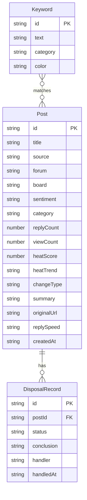

## 1. 架构设计

```mermaid
flowchart TD
    subgraph "前端层"
        "React 18 + TypeScript"
        "Tailwind CSS"
        "Zustand 状态管理"
        "React Router DOM"
    end
    subgraph "数据层"
        "Mock 数据服务"
        "本地状态存储"
    end
    "React 18 + TypeScript" --> "Mock 数据服务"
    "React 18 + TypeScript" --> "本地状态存储"
    "Zustand 状态管理" --> "本地状态存储"
```

## 2. 技术说明

- 前端：React@18 + Tailwind CSS@3 + Vite
- 初始化工具：vite-init
- 后端：无（纯前端，使用 Mock 数据）
- 数据库：无（使用 Zustand 内存状态 + Mock 数据模拟）

## 3. 路由定义

| 路由 | 用途 |
|------|------|
| / | 首页 - 关键词看板与今日变化 |
| /posts | 帖子列表页 - 多维筛选与分层浏览 |
| /daily-report | 日报生成页 - 高频槽点与风险等级 |

## 4. API 定义

无后端 API，使用前端 Mock 数据。数据结构定义如下：

```typescript
interface Keyword {
  id: string;
  text: string;
  category: 'brand' | 'product' | 'typo' | 'competitor';
  color: string;
}

interface Post {
  id: string;
  title: string;
  source: string;
  forum: string;
  board: string;
  sentiment: 'positive' | 'neutral' | 'negative';
  category: 'complaint' | 'help' | 'vent' | 'recommend';
  replyCount: number;
  viewCount: number;
  heatScore: number;
  heatTrend: 'rising' | 'stable' | 'declining';
  changeType: 'new' | 'hot' | 'negative_surge';
  summary: string;
  originalUrl: string;
  replySpeed: 'fast' | 'medium' | 'slow';
  createdAt: string;
  matchedKeywords: string[];
}

interface DisposalRecord {
  id: string;
  postId: string;
  status: 'customer_service' | 'legal' | 'observe';
  conclusion: string;
  handler: string;
  handledAt: string;
}

interface DailyReport {
  id: string;
  date: string;
  topComplaints: { keyword: string; count: number }[];
  typicalPosts: { postId: string; title: string; url: string; riskLevel: string }[];
  riskLevel: 'low' | 'medium' | 'high' | 'urgent';
  riskDescription: string;
}
```

## 5. 服务器架构图

不适用（纯前端项目）

## 6. 数据模型

### 6.1 数据模型定义



### 6.2 数据定义语言

不适用（纯前端 Mock 数据，无数据库）
